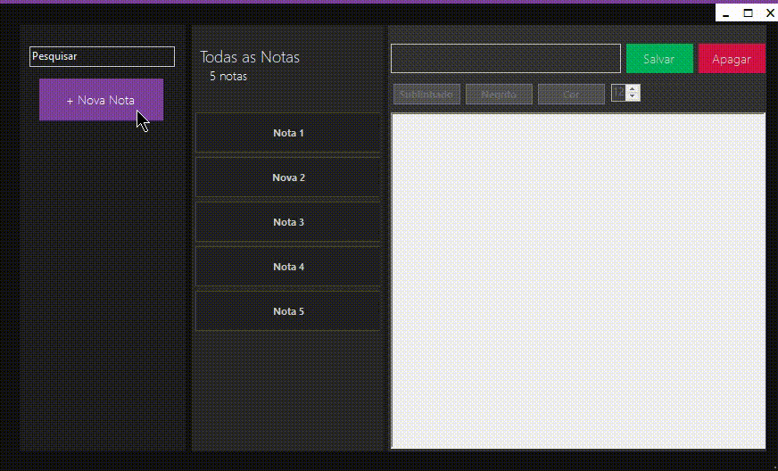
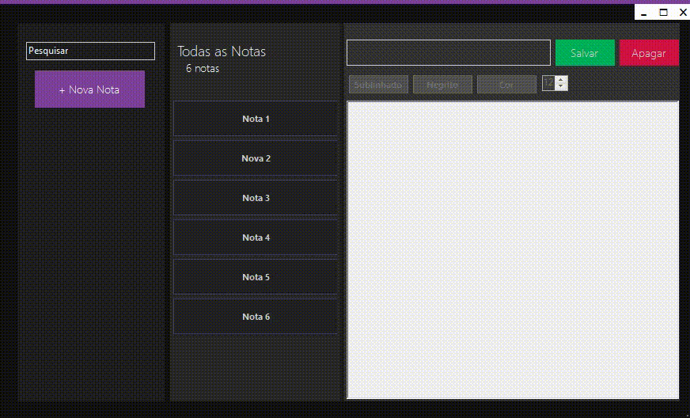
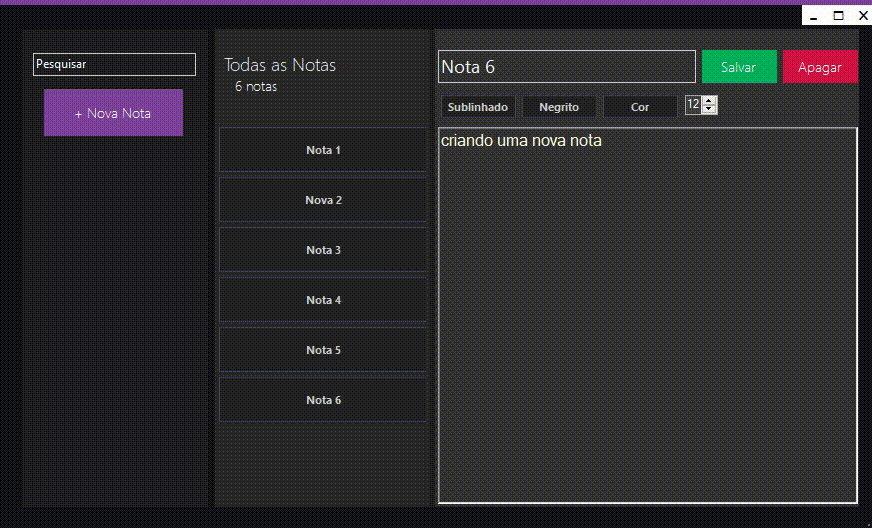

<h1>Note_sharp</h1>
<h2>Criando o banco de dados MySql</h2>
create database notesdb; 
use notesdb;

<h2>Criando a tabela de notas</h2>
create table notes( 
	id int primary key, 
	title char(255), 
	text_ text, 
	date_ datetime 
);

<h2>Criando uma nota</h2>

<h2>Acessando outras notas</h2>

<h2>Editando os textos</h2>

<h2>Apagando uma nota</h2>

